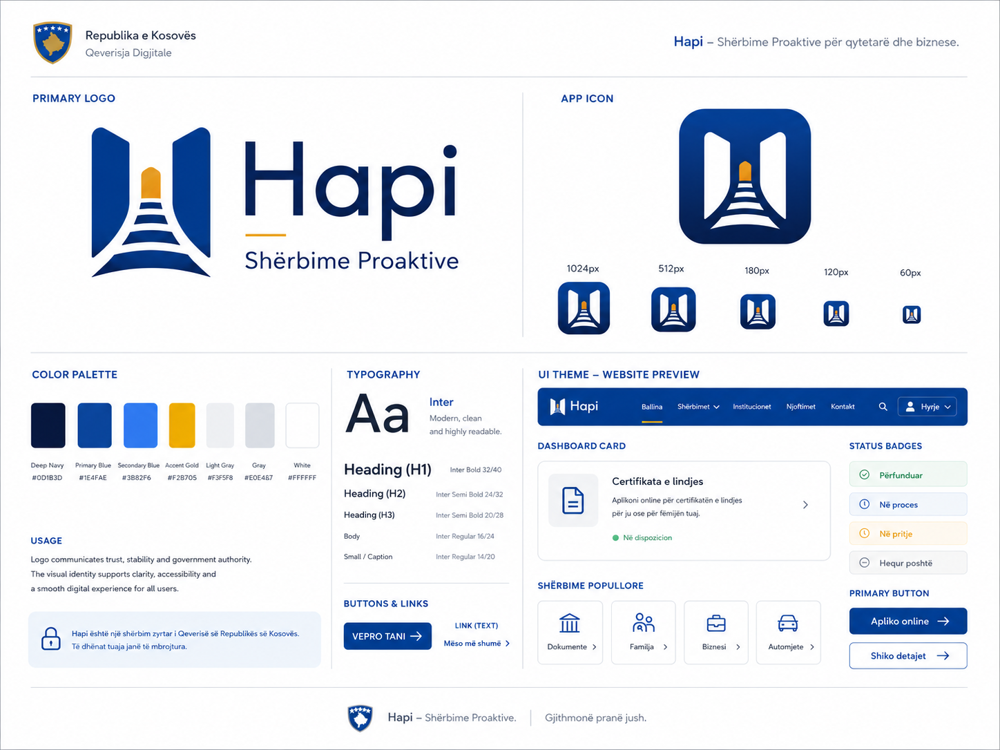

<div align="center">



# Hapi

**Shtresa proaktive për eKosova**

*Një ngjarje, gjithë shteti përgjigjet.*

<sub>One life event, the whole state responds.</sub>

<br />


</div>

---

Hapi is a **life-event orchestration layer** for the Republic of Kosovo's eKosova platform. When a major event happens in a citizen's life — a child is born, a citizen turns 18, a business is registered — Hapi detects it, creates one coordinated journey across every relevant institution, prepares documents in advance, and asks the citizen only for what the state doesn't already know.

It is **not a replacement for eKosova.** It's the coordination layer that sits beside it and makes services *come to* citizens instead of citizens chasing services.

## Demo

> **Local:** open [`index.html`](index.html) in any modern browser — no build, no server, no dependencies.
>
> **Deck:** open [`pitch-deck.html`](pitch-deck.html) and use ←/→, PgUp/PgDn, Home, End.

### Three-minute walkthrough

1. **Paneli** — open with the core line: *"Një ngjarje, gjithë shteti përgjigjet."*
2. Click **⚡ Simulo: ngjarja vjen vetë te qytetari**. The state acts first: a toast fires, the notification bell pops, a new entry slides in, dashboard counters tick up, and Hapi auto-opens *Lindja e Artës*.
3. Walk through Lirie giving birth to Arta in Prizren. Highlight **Pyet vetëm kur duhet** — she confirms IBAN, QMF, contact, and consent, but is never asked for data the state already has. Use **→ Ku shkojnë të dhënat e mia?** to surface the data-sharing map on demand.
4. **Asistenti AI** — Albanian-first guidance with guardrails (no invented institutions, no binding legal advice).
5. **Dokumentet** — the official-looking birth certificate with e-stamp, SHA fingerprint, and append-only document trail.
6. **Pranimi i rasteve** — the government-side case-management dashboard (Erza at Regjistri Civil).
7. Briefly hit **Biznesi** and **18 vjeç** to prove Hapi generalizes across all three trigger types.
8. Close with [`pitch-deck.html`](pitch-deck.html) for the structured 3-minute jury pitch.

The complete presenter script lives in [`DEMO_SCRIPT.md`](DEMO_SCRIPT.md).

## What's inside

### Three life events × three trigger types

| Life event | Trigger | Institutions | Steps | Documents |
| --- | --- | --- | ---: | ---: |
| **Lindja e fëmijës** | Institucional · spitali raporton | HRP · RC · MPMS · MSH · KP | 9 | 8 |
| **Regjistrimi i biznesit** | Nga qytetari · kërkesë | ARBK · RC · ATK · KP · BQK | 9 | 10 |
| **Mbushja 18 vjeç** | Automatik · T-30 nga RC | RC · MPB · KP · eKosova · MASHTI | 7 | 6 |

Selected because they exercise all three principal trigger categories (institutional, citizen-initiated, automatic), span 11 distinct institutions, and produce 20+ official documents — enough surface area to prove the model generalizes.

### Citizen surfaces

`Paneli` · `Katalogu i ngjarjeve` · `Lindja` · `Biznesi` · `18 vjeç` · `Asistenti AI` · `Dokumentet`

### Government surface

`Pranimi dhe menaxhimi i rasteve` — inbox, verification checklist, and step advancement for staff like Erza at Regjistri Civil.

## Design principles

- **The citizen is the protagonist.** Every screen answers *"what is happening for me right now?"* before *"what does the state need from me?"*
- **One event, one timeline.** Citizens see one chronological journey, not a list of unrelated tasks.
- **Documents look like documents.** Serif typography, formal layout, watermarks, visible cryptographic provenance.
- **Institutions remain visible.** Citizens always see which institution owns each step — Hapi does not hide the state apparatus.

## Project structure

```text
hapi-opendesign-package/
├── index.html                # clickable prototype (citizen + government)
├── pitch-deck.html           # 10-slide 16:9 jury deck
├── hapi-logo.png             # brand mark
├── DEMO_SCRIPT.md            # 3-minute presenter script
├── HAPI_APP_REQUIREMENTS.md  # full requirements spec (FR / NFR)
└── REQUIREMENT_COVERAGE.md   # traceability: requirements → prototype / deck
```

## Tech

The prototype is pure HTML, CSS, and vanilla JavaScript in a single file — no build, no dependencies, no backend. It's intentionally demo-grade, not production code.

The [requirements spec](HAPI_APP_REQUIREMENTS.md) outlines the v1 production stack: Next.js 14, TypeScript, Prisma + SQLite, NextAuth, Tailwind, and the Anthropic API (Claude Sonnet) for Albanian-language guidance.

## Positioning

Hapi is not a replacement for eKosova. It is a proactive life-event orchestration layer inside or beside eKosova: detection, journey creation, institution routing, document generation, notifications, deadline protection, AI guidance, and audit transparency.

## Team

**Voca · Erza · Devlete · Albatrit** — JunctionX ITP Prizren 2026 · *Proactive Government* track.

---

<div align="center">

*Citizens should not have to understand the structure of government to receive what they are entitled to.*

</div>
